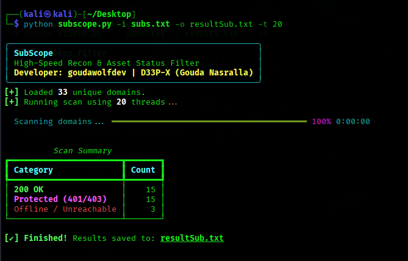

# 🎯 SubScope

> High-Performance, Multithreaded Web Asset Filter & Live Status Checker.

[](https://www.python.org/)
[](LICENSE)
[](#-author)

**SubScope** is a fast, lightweight, multithreaded Python tool designed for security researchers, sysadmins, and bug bounty hunters to resolve, verify, and filter large lists of subdomains and web assets in real-time.

---

## 📸 Preview



---

## ✨ Key Features

- 🚀 **High-Speed Probing**: Parallel execution using Python's `ThreadPoolExecutor`.
- ⚡ **Smart DNS Pre-Check**: Fast socket lookup to skip unresolvable domains and prevent thread hanging.
- 🔄 **Dual Probing Logic**: Utilizes fast HTTP `HEAD` requests with automatic `GET` fallback.
- 🎨 **Rich Terminal Interface**: Interactive progress bar and formatted summary table powered by `rich`.
- 📂 **Categorized Output**: Automatically groups domains by HTTP status codes (`200 OK`, `Redirects`, `Protected`, `404s`, `Server Errors`).
- 📄 **Multiple Formats**: Export results into clean human-readable text logs or structured `JSON`.

---

## 🛠️ Installation

```bash
# Clone the repository
git clone [https://github.com/goudawolfdev/SubScope.git](https://github.com/goudawolfdev/SubScope.git)

# Navigate to the project directory
cd SubScope

# Install required dependencies
pip install -r requirements.txt